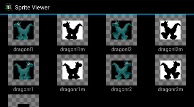

Sprite Viewer
=============

This application allows RISC OS spritefiles to be opened and their contents
viewed on Android devices.



Opening sprites from the viewer
-------------------------------

When launched as an application the viewer will show a selection of files with
recognised file extensions (`.spr`, `.ff9` and `,ff9`). Clicking on a file name
will show thumbnails of the sprites it contains. Sprites can be viewed at their
full resolution by long clicking on them to display them in an external viewer
application.

Pressing the device's back button will cause the file list to be shown again.

Opening sprites from a file browser
-----------------------------------

The viewer will respond to a request to open files with recognised file
extensions. However, this only seems to work on certain versions of Android.
On versions where it does work, clicking on a recognised file in a file
browser will cause the sprite viewer to be launched and the sprites in the
file to be displayed.

Pressing the device's back button when the viewer has been launched in this way
will cause the viewer to exit.

Documentation
-------------

Much of the code contains inline documentation that has been processed and
placed in the `Docs` directory. The [spriteviewer](Docs/spriteviewer.html)
module is probably the best place to start reading.

Building the application
------------------------

The application is written in the Serpentine language which requires the
[DUCK](http://www.boddie.org.uk/david/Projects/Python/DUCK/README.html)
software to be installed or on the `PYTHONPATH`. Additionally, you will need
to have created a key and signing certificate in order to create an installable
package.

The `build.py` script supplied with the application can then be run in the
following way, where `<key.pem>` and `<cert.pem>` are the locations of your
key and certificate files:

```\
./build.py <key.pem> <cert.pem> SpriteViewer.apk
```

You can then install the package on your Android device in the usual way.

License
-------

The source code is licensed under the GNU General Public License version 3 or
later. See the COPYING file for more information about this license. A short
version of the license is given below:

Copyright (C) 2017 David Boddie <david@boddie.org.uk>

This program is free software: you can redistribute it and/or modify
it under the terms of the GNU General Public License as published by
the Free Software Foundation, either version 3 of the License, or
(at your option) any later version.

This program is distributed in the hope that it will be useful,
but WITHOUT ANY WARRANTY; without even the implied warranty of
MERCHANTABILITY or FITNESS FOR A PARTICULAR PURPOSE.  See the
GNU General Public License for more details.

You should have received a copy of the GNU General Public License
along with this program.  If not, see <http://www.gnu.org/licenses/>.
